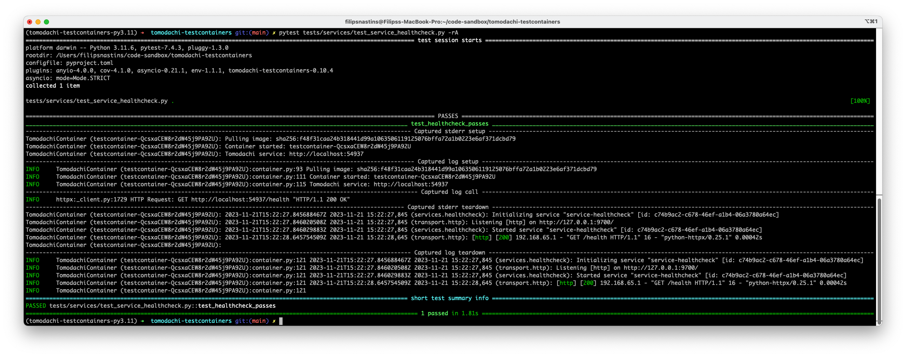
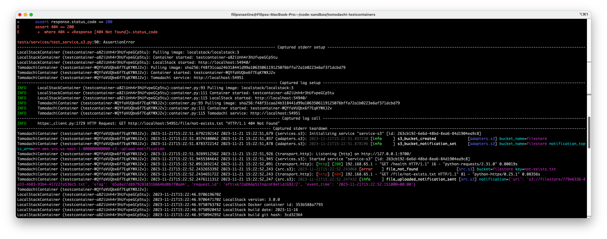

# Tomodachi Testcontainers


[](https://app.fossa.com/projects/git%2Bgithub.com%2Ffilipsnastins%2Ftomodachi-testcontainers?ref=badge_shield&issueType=license)
[](https://sonarcloud.io/summary/new_code?id=filipsnastins_tomodachi-testcontainers)
[](https://codescene.io/projects/46808)
[](https://codescene.io/projects/46808)
[](https://codecov.io/gh/filipsnastins/tomodachi-testcontainers)
[](https://codeclimate.com/github/filipsnastins/tomodachi-testcontainers/maintainability)

The library provides [Testcontainers](src/tomodachi_testcontainers/containers/),
[pytest fixtures](src/tomodachi_testcontainers/pytest/),
and [test clients](src/tomodachi_testcontainers/clients/) for working with Testcontainers,
and testing applications built with [Python Tomodachi framework](https://github.com/kalaspuff/tomodachi).

This library has been created to explore and learn Testcontainers.

Although it has been intended to be used with the Tomodachi framework,
it can be adapted to work with any Python or non-Python framework.

It's built on top of [testcontainers-python](https://github.com/testcontainers/testcontainers-python) library.

[Testcontainers](https://testcontainers.com/) is an open-source framework for providing throwaway,
lightweight instances of databases, message brokers, web browsers,
or just about anything that can run in a Docker container.
It facilitates the use of Docker containers for functional, integration, and end-to-end testing.

- [Tomodachi Testcontainers](#tomodachi-testcontainers)
  - [Documentation](#documentation)
  - [Installation](#installation)
  - [Quickstart and examples](#quickstart-and-examples)
  - [Getting started](#getting-started)
    - [Testing standalone Tomodachi service](#testing-standalone-tomodachi-service)
    - [Change Dockerfile path, build context and build target](#change-dockerfile-path-build-context-and-build-target)
    - [Running Tomodachi container from pre-built image](#running-tomodachi-container-from-pre-built-image)
    - [Testing Tomodachi service with external dependencies](#testing-tomodachi-service-with-external-dependencies)
  - [Benefits and dangers of end-to-end tests](#benefits-and-dangers-of-end-to-end-tests)
    - [Building confidence of releasability](#building-confidence-of-releasability)
    - [⚠️ Mind the Test Pyramid - don't overdo end-to-end tests](#️-mind-the-test-pyramid---dont-overdo-end-to-end-tests)
  - [Running Testcontainers in the deployment pipeline](#running-testcontainers-in-the-deployment-pipeline)
  - [Supported Testcontainers](#supported-testcontainers)
    - [Tomodachi](#tomodachi)
    - [Moto](#moto)
    - [LocalStack](#localstack)
    - [Minio](#minio)
    - [DynamoDB Admin](#dynamodb-admin)
    - [SFTP](#sftp)
    - [WireMock](#wiremock)
    - [MySQL](#mysql)
    - [PostgreSQL](#postgresql)
  - [Configuration with environment variables](#configuration-with-environment-variables)
  - [Change default Docker network](#change-default-docker-network)
  - [Forward Testcontainer logs to pytest](#forward-testcontainer-logs-to-pytest)
  - [Debugging Testcontainers](#debugging-testcontainers)
    - [1. Inspect container logs](#1-inspect-container-logs)
    - [2. Pause a test with a breakpoint and inspect running containers](#2-pause-a-test-with-a-breakpoint-and-inspect-running-containers)
    - [3. Use helper containers and tools for exploratory testing](#3-use-helper-containers-and-tools-for-exploratory-testing)
    - [4. Attach a remote debugger to a running container](#4-attach-a-remote-debugger-to-a-running-container)
  - [Exporting code coverage from Testcontainers](#exporting-code-coverage-from-testcontainers)
  - [Troubleshooting common issues](#troubleshooting-common-issues)
  - [Resources and acknowledgments](#resources-and-acknowledgments)
  - [Development](#development)

## Documentation

Find complete documentation at <https://filipsnastins.github.io/tomodachi-testcontainers/>;
contains more learning material, examples, recipes, and the code API reference.

## Installation

```sh
pip install tomodachi-testcontainers

# Extra dependencies:

# DatabaseContainer and SQLAlchemy
pip install tomodachi-testcontainers[db]

# MySQLContainer, SQLAlchemy and pymysql
pip install tomodachi-testcontainers[mysql]

# PostgreSQLContainer, SQLAlchemy and psycopg2
pip install tomodachi-testcontainers[postgres]

# SFTPContainer and asyncssh
pip install tomodachi-testcontainers[sftp]

# Installs python-wiremock SDK
pip install tomodachi-testcontainers[wiremock]
```

## Quickstart and examples

Tomodachi service examples are in [examples/](examples/) folder. Their end-to-end tests are in [tests/test_services](tests/test_services).

For full list of available testcontainers, check out [Supported Testcontainers](#supported-testcontainers) section,
[tomodachi_testcontainers.containers](src/tomodachi_testcontainers/containers/) module,
and the official [testcontainers-python](https://github.com/testcontainers/testcontainers-python) library -
it makes it easy to create your own Testcontainers.

For full list of available pytest fixtures check out [tomodachi_testcontainers.pytest](src/tomodachi_testcontainers/pytest/) module,
and for test clients - [tomodachi_testcontainers.clients](src/tomodachi_testcontainers/clients/) module.

## Getting started

### Testing standalone Tomodachi service

Starting with a simple service that returns `HTTP 200` on the `GET /health` endpoint.

We'd like to test that the service is working.
To do that, we'll package the application as a Docker image, run the container,
send some requests, and assert the responses.

The example assumes that a Dockerfile for running the service is present in the
current working directory. An [example Dockerfile](examples/Dockerfile) is in the [examples/](examples/).

```py
import tomodachi
from aiohttp import web


class TomodachiServiceHealthcheck(tomodachi.Service):
    name = "service-healthcheck"

    @tomodachi.http("GET", r"/health/?")
        async def healthcheck(self, request: web.Request) -> web.Response:
        return web.json_response(data={"status": "ok"})
```

The following `tomodachi_container` fixture builds and runs the service as a Docker container.

```py
from typing import Generator, cast

import pytest
from docker.models.images import Image

from tomodachi_testcontainers import TomodachiContainer
from tomodachi_testcontainers.utils import get_available_port


@pytest.fixture()
def tomodachi_container(testcontainers_docker_image: Image) -> Generator[TomodachiContainer, None, None]:
    with TomodachiContainer(
        image=str(testcontainers_docker_image.id),
        edge_port=get_available_port(),
    ) as container:
        yield cast(TomodachiContainer, container)
```

The `testcontainers_docker_image` fixture is from the `tomodachi_testcontainers` library.
It builds a Docker image from a Dockerfile located in the current working directory.

The container is started by the `TomodachiContainer` context manager.
When the context manager finishes, the built Docker image and containers are removed.

The `testcontainers_docker_image` fixture uses `tomodachi_testcontainers.EphemeralDockerImage`.
It automatically deletes the Docker image after the container is stopped.

Furthermore, the `tomodachi_container` fixture will start a new Tomodachi service container
and remove the old one for every test.

In this example, `tomodachi_container` fixture is used to test that the `GET /health` endpoint
returns status code `HTTP 200` and a correct JSON response.

```py
import httpx
import pytest

from tomodachi_testcontainers import TomodachiContainer


@pytest.mark.asyncio()
async def test_healthcheck_passes(tomodachi_container: TomodachiContainer) -> None:
    async with httpx.AsyncClient(base_url=tomodachi_container.get_external_url()) as client:
        response = await client.get("/health")

    assert response.status_code == 200
    assert response.json() == {"status": "ok"}
```

`tomodachi_container.get_external_url` returns the container's URL that is accessible from the
host, e.g. `http://localhost:12345`. The port is selected randomly by `get_available_port` function
that has been used in `tomodachi_container` fixture.

For inter-container communication, use `tomodachi_container.get_internal_url` instead.

That's it! 🎉 We have tested that the Docker image can be built and run, and that the service
is working as expected, all with a Docker container, on the highest test level - end-to-end.

### Change Dockerfile path, build context and build target

If the Dockerfile is not located in the current working directory or you need a different Docker build context,
specify a new path with the `TOMODACHI_TESTCONTAINER_DOCKERFILE_PATH` and `TOMODACHI_TESTCONTAINER_DOCKER_BUILD_CONTEXT`
environment variables.

Examples:

- `TOMODACHI_TESTCONTAINER_DOCKERFILE_PATH=examples/Dockerfile.testing`
- `TOMODACHI_TESTCONTAINER_DOCKER_BUILD_CONTEXT=examples/`

If you have a multi-stage Dockerfile and want to run testcontainer tests against a specific stage, specify the stage name
with the `TOMODACHI_TESTCONTAINER_DOCKER_BUILD_TARGET` environment variable.
Note that usually want to run tests against the release/production stage, so this environment variable is not needed in most cases,
as it's the last stage in the Dockerfile.

Example:

- `TOMODACHI_TESTCONTAINER_DOCKER_BUILD_TARGET=development`

### Running Tomodachi container from pre-built image

If the Tomodachi service Docker image is already built, you can run the container
by specifying the image ID in the `TOMODACHI_TESTCONTAINER_IMAGE_ID` environment variable.

It is useful when running tests in the deployment pipeline when the image has been already built on the build step.
Instead of building a new image from scratch for the tests, we want to test the exact same image that
will be pushed to a Container Registry and deployed to production.

Examples:

- `TOMODACHI_TESTCONTAINER_IMAGE_ID=sha256:56ca9586de1cf25081bb5f070b59b86625b6221bb26d7409a74e6051d7954c92`
- `TOMODACHI_TESTCONTAINER_IMAGE_ID=mycompany/my-tomodachi-application:1.0.0`

⚠️ Make sure that the environment variable is set before running `pytest`.

### Testing Tomodachi service with external dependencies

The main benefit of Testcontainers is that it allows testing an application with
production-like external dependencies - databases, message brokers, file stores, HTTP APIs, etc.

For example, let's test a Tomodachi service that uses AWS S3 to store files.
The `TomodachiServiceS3` has one endpoint `GET /file/<key>` that returns a content of a file stored in AWS S3.

```py
import os

import tomodachi
from aiobotocore.session import get_session
from aiohttp import web
from types_aiobotocore_s3 import S3Client


def get_s3_client() -> S3Client:
    return get_session().create_client(
        "s3",
        aws_access_key_id=os.getenv("AWS_ACCESS_KEY_ID"),
        aws_secret_access_key=os.getenv("AWS_SECRET_ACCESS_KEY"),
        endpoint_url=os.getenv("AWS_S3_ENDPOINT_URL"),
    )


class TomodachiServiceS3(tomodachi.Service):
    name = "service-s3"

    async def _start_service(self) -> None:
        self.bucket = "test-bucket"
        async with get_s3_client() as client:
            await client.create_bucket(Bucket=self.bucket)

    @tomodachi.http("GET", r"/file/(?P<key>[^/]+?)/?")
    async def get_file(self, request: web.Request, key: str) -> web.Response:
        async with get_s3_client() as client:
            s3_object = await client.get_object(Bucket=self.bucket, Key=key)
            content = await s3_object["Body"].read()
            return web.json_response({"content": content.decode()})
```

There are a couple of ways to test the service.

- Mock the AWS S3 client with `unittest.mock`:

  - The simplest way, but it doesn't test the actual AWS S3 integration.
  - We can't be sure that all calls to the AWS client are correct, without typos
    or surprising configuration mismatches.
  - Although unit tests are necessary, they won't give us the last bit of confidence that the service will work in production.
  - That's why it's necessary to _supplement_ unit tests with integration and end-to-end tests.

- Use a real AWS S3 bucket:

  - This is the most production-like way, but has some significant drawbacks in automated testing.
  - It requires a separate AWS account dedicated only to automated tests.
  - It's tricky to setup AWS credentials and permissions securely in the deployment pipeline.
  - Need to be careful to not mutate production infrastructure.
  - Costs some money for using real AWS services.
  - It's slow, because we're making real network calls to AWS.

- Use cloud environment mock library like [LocalStack](https://localstack.cloud/) or [Moto](https://docs.getmoto.org/en/latest/)

  - Although it's not a real AWS, it's very close to simulating AWS services,
    so that it can be confidently used in cloud service integration tests.
  - Battle-tested and used by many organizations with wide community support.
  - Easy to use on a local machine and in the deployment pipeline, simply run it in a Docker container and remove it when finished.
  - Works well with Testcontainers! This is the approach we'll take in this example. 🐳

As in the previous example, first, we need to create Tomodachi Testcontainer fixture
to build and run the service under test. It's done with a `tomodachi_container` fixture
in the example below.

```py
from typing import Generator, cast

import pytest
from docker.models.images import Image

from tomodachi_testcontainers import LocalStackContainer, TomodachiContainer
from tomodachi_testcontainers.utils import get_available_port


@pytest.fixture()
def tomodachi_container(
    testcontainers_docker_image: Image,
    localstack_container: LocalStackContainer,
) -> Generator[TomodachiContainer, None, None]:
    with (
        TomodachiContainer(image=str(testcontainers_docker_image.id), edge_port=get_available_port())
        .with_env("AWS_REGION", "us-east-1")
        .with_env("AWS_ACCESS_KEY_ID", "testing")
        .with_env("AWS_SECRET_ACCESS_KEY", "testing")
        .with_env("AWS_S3_ENDPOINT_URL", localstack_container.get_internal_url())
        .with_command("tomodachi run app.py --production")
    ) as container:
        yield cast(TomodachiContainer, container)
    localstack_container.restart()
```

This time, `tomodachi_container` fixture is more involved. It uses
`localstack_container` fixture, provided by `tomodachi_testcontainers` library.
The fixture starts a `LocalStackContainer`.

After the `LocalStackContainer` is started, we can use its `get_internal_url` method
to get the URL of the container that is accessible _inside_ the Docker network.
This time, we need the internal URL of the container, because the `TomodachiContainer`
needs to communicate with `LocalStackContainer`, and they both run in the same Docker network.

The LocalStack's `internal_url` is passed to `TomodachiContainer` as an environment variable `AWS_S3_ENDPOINT_URL`,
following [12-factor app principle of providing app configuration in environment variables](https://12factor.net/config).

On `tomodachi_container` fixture teardown, `LocalStack` container is restarted
to reset its state - delete all S3 buckets and files. This way we can be sure
that each test starts with a clean state.
As alternative for calling `restart` method explicitly,
you can use `_restart_localstack_container_on_teardown` fixture.
We avoid flaky tests that depend on the state of the previous test or their execution order,
and avoid leaking test data from one test to another.
As a drawback, it takes a more time to restart a container after every test.
To improve test execution speed, you can explicitly cleanup AWS resources, for example,
deleting all S3 buckets and DynamoDB tables after every test.

That's the setup, now on to the application test. 🧪

```py
import httpx
import pytest
from types_aiobotocore_s3 import S3Client

from tomodachi_testcontainers import TomodachiContainer


@pytest.mark.asyncio()
async def test_upload_and_read_file(
    tomodachi_container: TomodachiContainer,
    localstack_s3_client: S3Client,
) -> None:
    await localstack_s3_client.put_object(
        Bucket="test-bucket",
        Key="hello-world.txt",
        Body=b"Hello, World!",
    )

    async with httpx.AsyncClient(base_url=tomodachi_container.get_external_url()) as http_client:
        response = await http_client.get("/file/hello-world.txt")

    assert response.status_code == 200
    assert response.json() == {"content": "Hello, World!"}
```

In the test setup/arrangement step, the test uses `localstack_s3_client`
fixture to upload a file to the AWS S3 bucket. The `localstack_s3_client`
is yet another helper fixture provided by `tomodachi_testcontainers`.
It creates a new S3 client configured to communicate with the `LocalStackContainer`.

For full list of available fixtures, check out
[tomodachi_testcontainers.pytest](src/tomodachi_testcontainers/pytest/) module.

In the act step, the test sends a request to the `GET /file/hello-world.txt` endpoint
to read the contents of a file, and in the assert step verifies that the response is correct.

⚠️ Note that to make the request to the running `TomodachiContainer`, the
`tomodachi_container.get_external_url` is used to get the URL
of the `TomodachiContainer` that is accessible from the host, because the
`pytest` runs on the host machine, and not inside the Docker network.

Awesome! 🚀 We have tested that our application is working with production-like
infrastructure, and established confidence that it will work
in the real environment as well.

For more examples, see [examples/](examples/) and tests in [tests/test_services](tests/test_services).

## Benefits and dangers of end-to-end tests

### Building confidence of releasability

The examples from this guide and [tests/test_services](tests/test_services) show that end-to-end tests
are powerful kind of tests. End-to-end test are used to test the system from its users perspective,
be it a human being or another application. End-to-end tests test the system from the outside,
on its public API level.

_End-to-end tests build the last bit of confidence of releasability -
that the system will work in production without more manual testing._

_To get a high confidence of releasability, it's necessary to test the system with real dependencies and infrastructure.
Testcontainers make it easy to spin up real dependencies in Docker containers, and throw them away
when the tests are finished. They work in the same way locally and in the deployment pipeline, so you need to
setup test suite only once._

### ⚠️ Mind the Test Pyramid - don't overdo end-to-end tests

Despite many benefits of end-to-end tests, they are the most expensive kind 💸 -
they're slow, sometimes [flaky](https://martinfowler.com/articles/nonDeterminism.html),
it's hard to understand what's broken when they fail.

End-to-end tests are expensive, but necessary to build confidence of releasability,
so it's important to use them intentionally and know about other kinds of tests.
After all, we can't be confident that the system _really_ works in production if we haven't
tested it in the environment as close to production as possible.

The [Test Pyramid](https://martinfowler.com/bliki/TestPyramid.html) is a useful thinking model about
different kinds of tests and their value. It proposes that the majority of tests should be unit tests,
followed by integration tests, and the least amount of tests should be end-to-end tests.

The book [Architecture Patterns with Python](https://www.cosmicpython.com/) by Harry Percival and Bob Gregory
describes a useful [rule of thumb for use of different types of tests](https://www.cosmicpython.com/book/chapter_05_high_gear_low_gear.html#types_of_test_rules_of_thumb):

- **Aim for one end-to-end test per feature; error handling counts as a feature** - it suggests using
  end-to-end tests to demonstrate that the feature works, and all the system components that build
  the feature are working together correctly. _It means that end-to-end tests shouldn't be used
  as the main way of testing the system due to their cost and brittleness,
  but rather as a way to supplement service layer and unit tests._

- **Write the bulk of your tests against the service layer; maintain a small core of tests written against your domain model** -
  if you keep your application business logic use cases decoupled from the framework,
  you can test most of the system without the need to rely on slow, real dependencies.
  You can use fakes for simulating input/output (databases, message brokers, external system adapters),
  making the tests focused on the business logic.

The [Architecture Patterns with Python](https://www.cosmicpython.com/) book neatly describes patterns for building
robust and testable applications, so if you want to learn more, I highly recommend it as a starting point.
Also, it's free! 📖

Another point worth noting about different test types is that, ideally, tests should be written on the same level of abstraction. ⚖️

If means that if you're writing, for example, end-to-end tests, you should strive to use only the public API of the application -
HTTP endpoints, message topics or queues, etc. - to test the system, and not use any internal implementation details, like
directly accessing a database.

For example, the test `test_create_order` in [tests/test_services/test_order_service.py](tests/test_services/test_order_service.py)
asserts that an order has been created by calling the public API endpoints `GET /orders/<order_id>`,
instead of querying `orders` table directly to assert that the order row has been created with correct data.

This way, the internal `orders` table can be changed without breaking end-to-end tests,
as long as the public API stays the same. However, if the `GET /orders` has a bug,
all the tests that use `GET /orders` will fail, and it might not be intuitive to find the problem right away.
That's a trade-off we need to make in order to not expose system's private data structures and internal implementation details.

The same principle applies to other test types. In service layer tests, you'd be using only
use case functions to test the system, and not accessing domain model objects directly.
In case of domain model tests or unit tests, you'd be testing only public methods of the objects,
and not private methods and attributes.
Since there're no explicit private methods and attributes in Python, it's important to remember this,
and use automated code quality assertion tools like `flake8` and `pylint` as a safety net.

## Running Testcontainers in the deployment pipeline

To run Testcontainers in the deployment pipeline, you'll need a container runtime installed
on the CI/CD server (GitHub Actions, Jenkins etc.). That's pretty much it!

Running Testcontainers in the deployment pipeline shouldn't be much different from running them locally.

For a complete example of how to run Testcontainers in the deployment pipeline, check out
[tomodachi-testcontainers-github-actions](https://github.com/filipsnastins/tomodachi-testcontainers-github-actions)
repository.

## Supported Testcontainers

Phew! 😅
After going though all examples and understanding [benefits and dangers of end-to-end tests](#benefits-and-dangers-of-end-to-end-tests),
you're well-equipped to get the most value out of Testcontainers.

Bellow is the list of available Testcontainers in this library.
Feel free to explore how they're implemented and create your own Testcontainers as you go.
[testcontainers-python](https://github.com/testcontainers/testcontainers-python) provide and easy way
to create your own Testcontainers.

| Container Name | Default Image                     | Fixture                                            |              Image Env Var Override |
| :------------- | :-------------------------------- | :------------------------------------------------- | ----------------------------------: |
| Tomodachi      | n/a (build from Dockerfile)       | n/a                                                |  `TOMODACHI_TESTCONTAINER_IMAGE_ID` |
| Moto           | `motoserver/moto:latest`          | `moto_container`                                   |       `MOTO_TESTCONTAINER_IMAGE_ID` |
| LocalStack     | `localstack/localstack:3`         | `localstack_container`                             | `LOCALSTACK_TESTCONTAINER_IMAGE_ID` |
| Minio          | `minio/minio:latest`              | `minio_container`                                  |      `MINIO_TESTCONTAINER_IMAGE_ID` |
| DynamoDBAdmin  | `aaronshaf/dynamodb-admin:latest` | n/a (use on demand for exploring data in DynamoDB) |                                 n/a |
| SFTP           | `atmoz/sftp:latest`               | `sftp_container`                                   |       `SFTP_TESTCONTAINER_IMAGE_ID` |
| WireMock       | `wiremock/wiremock:latest`        | n/a (can't be generalized, copy from examples)     |                                 n/a |
| MySQL          | `mysql:8`                         | `mysql_container`                                  |      `MYSQL_TESTCONTAINER_IMAGE_ID` |
| PostgreSQL     | `postgres:16`                     | `postgres_container`                               |   `POSTGRES_TESTCONTAINER_IMAGE_ID` |

### Tomodachi

Tomodachi - a lightweight microservices library on Python asyncio.

Repository: <https://github.com/kalaspuff/tomodachi>

### Moto

Moto is a library that allows your tests to mock out AWS Services.

Repository: <https://github.com/getmoto/moto>

Docker Hub: <https://hub.docker.com/r/motoserver/moto>

### LocalStack

LocalStack provides an easy-to-use test/mocking framework for developing cloud applications.

Repository: <https://github.com/localstack/localstack>

DockerHub: <https://hub.docker.com/r/localstack/localstack>

### Minio

MinIO is a High Performance Object Storage released under GNU Affero General Public License v3.0. It is API compatible with Amazon S3 cloud storage service.

Repository: <https://github.com/minio/minio>

DockerHub: <https://hub.docker.com/r/minio/minio>

### DynamoDB Admin

GUI for DynamoDB Local, dynalite, localstack etc. Useful for exploring DynamoDB tables and data during development and testing.

Repository: <https://github.com/aaronshaf/dynamodb-admin>

DockerHub: <https://hub.docker.com/r/aaronshaf/dynamodb-admin>

### SFTP

Easy to use SFTP (SSH File Transfer Protocol) server with OpenSSH.

Repository: <https://github.com/atmoz/sftp>

DockerHub: <https://hub.docker.com/r/atmoz/sftp>

- Available as an extra dependency `sftp` - install with
  `pip install tomodachi-testcontainers[sftp]` or `poetry install -E sftp`

### WireMock

WireMock is a tool for building mock APIs. Create stable development environments,
isolate yourself from flaky 3rd parties and simulate APIs that don't exist yet.

Repository: <https://github.com/wiremock/wiremock>

DockerHub: <https://hub.docker.com/r/wiremock/wiremock>

Python SDK: <https://github.com/wiremock/python-wiremock>

### MySQL

MySQL is a widely used, open-source relational database management system (RDBMS).

DockerHub: <https://hub.docker.com/_/mysql>

### PostgreSQL

The PostgreSQL object-relational database system provides reliability and data integrity.

DockerHub: <https://hub.docker.com/_/postgres>

## Configuration with environment variables

⚠️ Make sure that environment variables are set before running `pytest` -
e.g. with [pytest-env](https://pypi.org/project/pytest-env/) plugin or
by setting it in the shell before running `pytest`.

| Environment Variable                           | Description                                                                                                 |
| :--------------------------------------------- | :---------------------------------------------------------------------------------------------------------- |
| `<CONTAINER-NAME>_TESTCONTAINER_IMAGE_ID`      | Override any supported Testcontainer Image ID. Defaults to `None`                                           |
| `DOCKER_BUILDKIT`                              | Set `DOCKER_BUILDKIT=1` to use Docker BuildKit for building Docker images                                   |
| `TESTCONTAINER_DOCKER_NETWORK`                 | Launch testcontainers in specified Docker network. Defaults to 'bridge'. Network must be created beforehand |
| `TOMODACHI_TESTCONTAINER_DOCKERFILE_PATH`      | Override path to Dockerfile for building Tomodachi service image. (`--file` flag in `docker build` command) |
| `TOMODACHI_TESTCONTAINER_DOCKER_BUILD_CONTEXT` | Override Docker build context                                                                               |
| `TOMODACHI_TESTCONTAINER_DOCKER_BUILD_TARGET`  | Override Docker build target (`--target` flag in `docker build` command)                                    |
| `TOMODACHI_TESTCONTAINER_EXPORT_COVERAGE`      | Set `TOMODACHI_TESTCONTAINER_EXPORT_COVERAGE=1` to export `.coverage` file when the container stops.        |

## Change default Docker network

By default, testcontainers are started in the default `bridge` Docker network.
Sometimes it's useful to start containers in a different network, e.g. a network
specifically dedicated for running automated tests.

Specify a new network name with the `TOMODACHI_TESTCONTAINER_NETWORK` environment variable.
The Docker network is not created automatically, so make sure that it exists before running tests.

⚠️ Make sure that the environment variable is set before running `pytest`.

## Forward Testcontainer logs to pytest

Logs from a testcontainer are forwarded to Python's standard logger as `INFO` logs when
`tomodachi_testcontainers.DockerContainer` context manager exits.

To see the logs in pytest, set the log level to at least `INFO` in [pytest configuration](https://docs.pytest.org/en/7.1.x/how-to/logging.html).

Capturing container logs is useful to see what happened inside a container if a test failed.
It's especially useful if tests have failed in CI, because the containers are immediately deleted
after the test run, and there's nothing else to inspect apart from logs.

```toml
[tool.pytest.ini_options]
log_level = "INFO"
```

By default, `pytest` won't show any output if all tests pass. To see the logs in the console, run `pytest` with `-rA` flag,
e.g. `pytest -rA`. It will show extra summary for A(ll) tests, including captured logs.

```sh
-r chars              Show extra test summary info as specified by chars: (f)ailed, (E)rror, (s)kipped, (x)failed, (X)passed, (p)assed, (P)assed with output, (a)ll except passed (p/P), or (A)ll. (w)arnings are enabled by default (see --disable-warnings), 'N' can be used to reset the list. (default: 'fE').
```

- `pytest tests/services/test_service_healthcheck.py -rA`



- `pytest tests/services/test_service_s3.py -k test_upload_and_read_file`



## Debugging Testcontainers

Debugging failing Testcontainer tests can be tricky. The code is running in separate ephemeral Docker containers
that are immediately deleted after the test run finishes.

Bellow are some debugging and exploratory testing tips that will help you to debug failing Testcontainer tests.

### 1. Inspect container logs

Logs are the main source of information when debugging Testcontainers.
Generally, you should be able to pinpoint any problem by looking at the container logs,
in the same way as you'd investigate a problem in a production environment.
If you find it difficult to understand how the system is behaving from the logs,
it's be a sign that the logging is insufficient and needs to be improved.

By default, `tomodachi_testcontainers` will forward all container logs to Python's standard logger
as `INFO` logs when containers stop. See [Forward Testcontainer logs to pytest](#forward-testcontainer-logs-to-pytest)
section for more information and examples of how to configure pytest to show the logs.

Running Testcontainer tests is a great way to do exploratory testing of the system,
check out if log messages are meaningful and it's easy to understand what the system is doing.

### 2. Pause a test with a breakpoint and inspect running containers

Testcontainers are ephemeral - they're removed immediately after the test run finishes.
Sometimes it's useful to inspect the state of running containers,
e.g. manually check the contents of a database, S3 buckets, message queues or various logs at a certain point in time.

To do that, pause the execution of a test with a breakpoint and manually inspect running containers:

```py
import httpx
import pytest


@pytest.mark.asyncio()
async def test_healthcheck_passes(http_client: httpx.AsyncClient) -> None:
    response = await http_client.get("/health")

    # The breakpoint will pause the execution of the test
    # and allow you to inspect running Docker containers.
    breakpoint()

    assert response.status_code == 200
    assert response.json() == {"status": "ok"}
```

### 3. Use helper containers and tools for exploratory testing

When logs are insufficient to understand what's going on, it's useful to use other helper containers and tools
for inspecting container state, e.g. what's in the database, S3 buckets, message queues, etc.

[Pause a test with a breakpoint](#2-pause-a-test-with-a-breakpoint-and-inspect-running-containers)
and inspect running containers with other tools, for example:

- Use AWS CLI with `aws --endpoint-url=http://localhost:<port>` to inspect the state of `LocalStack` or `Moto` containers.
  Find out `LocalStack` or `Moto` port in the pytest console output or by inspecting the containers with `docker ps`.
- `Moto` provides a convenient [web UI dashboard](https://docs.getmoto.org/en/latest/docs/server_mode.html#dashboard).
  Find the link to the Moto dashboard in the pytest console output.
- Use [DynamoDB Admin](#dynamodb-admin) container for inspecting the state of DynamoDB tables.

### 4. Attach a remote debugger to a running container

As a last resort, you can attach a remote debugger to a running container, e.g. to a `TomodachiContainer` that's running your application code.

See an example of how to start `TomodachiContainer` in the debug mode in [tests/services/test_service_debug.py](tests/services/test_service_debug.py).
If using `VScode`, see the [documentation](https://code.visualstudio.com/docs/python/debugging#_debugging-by-attaching-over-a-network-connection)
of how to attach a remote debugger to a running process over HTTP.
An example configuration is in the [.vscode/launch.example.json](.vscode/launch.example.json)

## Exporting code coverage from Testcontainers

Since Testcontainers run in a separate Docker container, their code coverage will not be included to the coverage report by default.

Assuming you're using [coverage.py](https://github.com/nedbat/coveragepy) or [pytest-cov](https://github.com/pytest-dev/pytest-cov),
to see the code coverage from the Testcontainer, you need to export the `.coverage` file from the container to the host machine,
and then append it to the root `.coverage` report.

To generate the code coverage report from `TomodachiContainer`, start the container with the `coverage run -m tomodachi run ...` command.
The `coverage` tool will keep track of the code that has been executed in the container,
and write the coverage report to `.coverage` file when the container stops.

```py
from typing import Generator, cast

import pytest
from docker.models.images import Image

from tomodachi_testcontainers import TomodachiContainer
from tomodachi_testcontainers.utils import get_available_port


@pytest.fixture()
def tomodachi_container(testcontainers_docker_image: Image) -> Generator[TomodachiContainer, None, None]:
    with TomodachiContainer(
        image=str(testcontainers_docker_image.id),
        edge_port=get_available_port(),
    ).with_command(
        "bash -c 'pip install coverage[toml] && coverage run -m tomodachi run src/healthcheck.py --production'"
    ) as container:
        yield cast(TomodachiContainer, container)
```

Configure the `coverage` tool in the `pyproject.toml` file - see [examples/pyproject.toml](examples/pyproject.toml).

To signal the `TomodachiContainer` to export the `.coverage` file when the container stops,
set the `TOMODACHI_TESTCONTAINER_EXPORT_COVERAGE` environment variable to `1`.
Coverage export is disabled by default to not pollute the host machine with `.coverage` files.
Generally, you'll be running tests with coverage in the deployment pipeline,
so set the environment variable in the CI/CD server configuration.

Tying it all together, run pytest with the coverage mode:

```sh
TOMODACHI_TESTCONTAINER_EXPORT_COVERAGE=1 pytest --cov --cov-branch
```

The `.coverage` file will be saved on the host machine in the current working directory.
Also, see [dev.py::test_ci](dev.py) for an example of how this project is running tests with code coverage in the deployment pipeline.

If source code paths are different in the container and on the host machine, e.g. because the container
is running in a different directory, you might have to re-map the paths with `coverage` tool.
See [Re-mapping paths](https://coverage.readthedocs.io/en/7.3.2/cmd.html#re-mapping-paths) in the
`coverage.py` documentation, and configuration example in the [pyproject.toml](pyproject.toml) (search for 'tool.coverage' section).

See an example of how the combined test coverage looks at <https://app.codecov.io/gh/filipsnastins/tomodachi-testcontainers>.
The [examples/](examples/) services are tested only with Testcontainer tests, and their coverage is included in the final report.

## Troubleshooting common issues

- Error on running tests with pytest: `ScopeMismatch: You tried to access the function scoped fixture
event_loop with a session scoped request object, involved factories`.

  - **Problem:** the error occurs when you're using asynchronous fixtures with the scope higher
    than `function` e.g. fixture `moto_container` has `session` scope.
    The default `event_loop` fixture provided by `pytest-asyncio` is a function-scoped fixture,
    so it can't be used with session-scoped fixtures.

  - **Solution:** override the `event_loop` fixture with a session-scoped fixture
    by placing it to your project's default `conftest.py`.
    See [tests/conftest.py](tests/conftest.py) for an example:

## Resources and acknowledgments

- [testcontainers.com](https://testcontainers.com/) - home of Testcontainers.

- [testcontainers-python](https://testcontainers-python.readthedocs.io/) - Python SDK for Testcontainers.

- Talk ["Integration tests are needed and simple"](https://softwaregarden.dev/en/talks/integration-tests-are-needed-and-simple/)
  by [Piotr Przybyl](https://softwaregarden.dev/en/) - explains the why behind the need
  for integration testing with real dependencies and gives a demo on Testcontainers.

- [tomodachi-testcontainers-github-actions](https://github.com/filipsnastins/tomodachi-testcontainers-github-actions) -
  example of running Testcontainers in the deployment pipeline.

- [Awaitility](https://github.com/awaitility/awaitility) for Java and [busypie](https://github.com/rockem/busypie)
  for Python - libraries for testing asynchronous systems with async probes.

- <https://www.cosmicpython.com> - Architecture Patterns with Python book.
  Described [a rule of thumb for use of different types of tests in the test pyramid](https://www.cosmicpython.com/book/chapter_05_high_gear_low_gear.html#types_of_test_rules_of_thumb).

- <https://martinfowler.com/bliki/TestPyramid.html> - concise explanation of the test pyramid
  with useful references and further readings.

- Two contradictory articles about end-to-end tests:
  - <https://testing.googleblog.com/2015/04/just-say-no-to-more-end-to-end-tests.html>
  - <https://www.symphonious.net/2015/04/30/making-end-to-end-tests-work/>

## Development

- Install dev dependencies with [Poetry](https://python-poetry.org/)

```sh
poetry install --all-extras --with dev --with docs
poetry shell
pre-commit install
```

- Run tests

```sh
docker network create tomodachi-testcontainers

poetry run test
poetry run test-ci  # With code coverage
```

- Format and lint code

```sh
poetry run format
poetry run lint
```

- Run all commit hooks at once

```sh
poetry run hooks
```

- Build package release

```sh
poetry build
```

- Develop documentation with [Material for MkDocs](https://squidfunk.github.io/mkdocs-material/)

```sh
mkdocs serve
```

- Generate C4 diagrams with PlantUML from [docs/architecture/c4](docs/architecture/c4)
  (get plantuml.jar at <https://plantuml.com/starting>).

```sh
export JAVA_HOME=`/usr/libexec/java_home -v 21`

java -jar plantuml.jar -DRELATIVE_INCLUDE="." docs/**/*.puml
```
