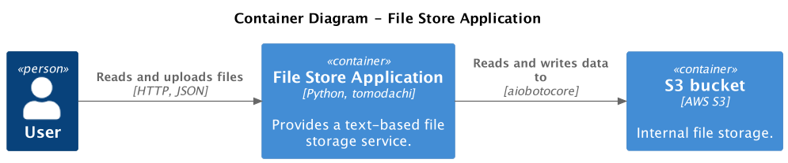

# Testing Applications with Backing Services

Applications don't live in isolation. They depend on other backing services - databases, file exchanges, cloud provider services, third-party services, etc.
It makes testing difficult - the test environment must have a lot of things configured for the application to work.
Remember spending hours setting up a local development environment?

## Running backing services locally

You should be able to run your application's tests on your local machine to get fast feedback about the changes.
Imagine how the workflow would look if the tests worked only in the deployment pipeline -
you had to push changes to version control and wait for the CI server to finish the build every time you wanted to verify a small code change.
It would create unnecessary friction for integrating automated testing into the development workflow.

That's where Testcontainers are very useful - they automate the creation of the application's dependencies.
They're run as Docker containers and thrown away when tests finish.
Testcontainers make configuration of your local development environment easy -
all its components are defined as code in the same repository and created the same way every time you run the tests.

!!! success "Run tests locally"

    Design your tests so they run locally without any additional configuration.
    Make the test fixtures configure backing services automatically with Testcontainers.

## Running production-like versions of backing services

Tests should give us confidence that an application will work in a production environment.
The tests are of little value if they're passing, but the application doesn't work for the actual users.
One of the key elements for creating reliable tests is making the development and testing environment as
similar to production as possible. To achieve [dev/prod parity](https://12factor.net/dev-prod-parity),
apart from using production-like data and configuration, we must run the same versions of backing services in the development environment as in production.
For example, we can run the same versions of databases like PostgreSQL or MongoDB and message brokers like RabbitMQ
(see the [Testing Databases](../guides/testing-databases.md) guide for more examples).
However, it gets more complicated when an application depends on proprietary software or managed cloud services that can't be run locally,
for example, AWS S3 file store or AWS SNS/SQS message broker.

When a particular dependency can't be run locally, e.g., because it's a managed cloud provider service like AWS S3, we have ther testing options:

- Using a real version of an external service, e.g., testing with a real AWS account.
- Mocking the interactions with an external service, e.g., with Python's [`unittest.mock`](https://docs.python.org/3/library/unittest.mock.html#module-unittest.mock).
- Using verified external mocks, e.g., [LocalStack](https://localstack.cloud/) and [Moto](https://docs.getmoto.org/en/latest/), for emulating the AWS cloud.

Using a real AWS account for testing is the most production-like way. The tests must use a dedicated AWS account only for autotests and have
safeguards that they're not accidentally connected to a production account. There's a risk of changing production resources if tests are misconfigured.
Using real services will create additional costs in cloud bills and maintenance time that need to be accounted for.
Lastly, the tests will be slower because they'll communicate over the external network and might become flaky if multiple test suites are using the same resources simultaneously.
Ultimately, using the real services shouldn't be your default choice due to the complexity and costs.

The second option is mocking the interactions with mocks, e.g., [`unittest.mock`](https://docs.python.org/3/library/unittest.mock.html#module-unittest.mock).
This way, we verify that the code calls external dependency in a way we expect but doesn't verify if the call would succeed in the real environment.
For example, we can mock calls to the AWS `boto3` client and remove any dependencies on the cloud service from the tests.
The tests will be fast because because there'll be no network calls. However, they won't ensure that the code will work in the real environment
because we might accidentally misconfigure the mocks, and the tests won't notice that.
Although unit tests are handy because of the low cost and fast runtime, they must be supplemented by other production-like tests.

The last option - verified external mocks - combines the first two approaches.
Since applications usually interact with cloud providers through its REST API,
we can substitute the endpoint URL with a more sophisticated type of mock that can be run locally.
From the application's perspective, it wouldn't know nor care that it's interacting with a fake service.
What matters is that it behaves the same.

Projects like [LocalStack](https://localstack.cloud/) and [Moto](https://docs.getmoto.org/en/latest/) are web applications
that emulate AWS cloud - they provide the same API and behavior for _local development and testing_.
[Similar tools](https://testcontainers.com/modules/?category=cloud) exist for other cloud providers.
Cloud emulators are tested against a real cloud provider to ensure they behave the same; hence, they're verified mocks.
However, they're still not always accurate. You might encounter some corner cases where the mocks didn't catch a problem, and it surfaced only in a real environment.
Check out [LocalStack feature coverage](https://docs.localstack.cloud/user-guide/aws/feature-coverage/)
and [Moto supported services](https://docs.getmoto.org/en/latest/docs/services/index.html) for more details.
Despite that, such services are battle-tested, have extensive open-source community support, and are _good enough_ for most use cases.
Running cloud mocks with Testcontainers is easy because they're simply web applications.
That's the route we'll take in the following sections of this guide.

Lastly, it's worth mentioning that despite testing with verified mocks like LocalStack,
you might stumble upon unsupported features or inaccurate behavior, or you are working with a critical part of the system where the cost of failure is high.
For such cases, you might want to consider testing _parts_ of your application with a real external dependency.
Take all precautions - run such tests only in a deployment pipeline, disable them locally, and always use a separate account dedicated only to automated testing.
To make testing only certain parts of your application easy, modularize those components, for example, with the [Ports & Adapters pattern](../guides/ports-and-adapters/).

!!! success "Test with production-like dependencies"

    Test your application with production-like dependencies with the same configuration for [dev/prod parity](https://12factor.net/dev-prod-parity).

    You can run the identical versions of some dependencies locally, e.g., PostgreSQL database or RabbitMQ message broker.
    Other dependencies, e.g., a managed cloud provider service, can't be run locally.
    Find an alternative for local development like [LocalStack](https://localstack.cloud/) and [Moto](https://docs.getmoto.org/en/latest/)
    AWS cloud emulators.

    If you can't run a dependency locally and no alternatives for local development and testing exist, e.g., for Oracle Enterprise Database,
    resort to testing with a dedicated instance running in a separate test environment, or consult your software vendor.

## Example: Testing file store application with AWS S3 and LocalStack

Let's test an example file store application.
The application provides a simple REST API for storing and retrieving text files.
For a data store, the application uses AWS S3.

<figure markdown>
  
</figure>

### Creating the file store application

The example app has two endpoints - `POST /file` and `GET /file/<name>`.
In the backend, the app uses AWS S3 operations `put_object` and `get_object` to store and retrieve files.

```py title="src/app.py" hl_lines="14 22"
--8<-- "docs_src/getting_started/s3/app.py"
```

The app is configured with environment variables, following the [12-factor app principle](https://12factor.net/config).
The required configuration value is `AWS_S3_BUCKET_NAME` for specifying the bucket name for the datastore.
Other optional values are `AWS_ACCESS_KEY_ID` and `AWS_SECRET_ACCESS_KEY` for credentials and `AWS_S3_ENDPOINT_URL` for overriding the AWS endpoint.

We [treat all backing services as attachable resources](https://12factor.net/backing-services) - they're substitutable by changing the application's
configuration, such as the `AWS_S3_ENDPOINT_URL`. This approach makes testing and deployment to different environments possible.
We can use other instances of backing services in different environments, including in automated testing.

```py title="src/aws.py"
--8<-- "docs_src/getting_started/s3/aws.py"
```

### Configuring Testcontainers

As in the [previous getting started guide](./testing-simple-app.md), the first step is writing Testcontainer fixtures.
This example is more involved because the application depends on the external service - AWS cloud.
Since we don't want to use the real AWS account for automated testing, we'll use a [`LocalStackContainer`][tomodachi_testcontainers.LocalStackContainer].
We can access it with the [`localstack_container`][tomodachi_testcontainers.pytest.localstack_container] fixture.

Next, we need to configure our application's container with environment variables.
The important part is setting the environment variable `AWS_S3_ENDPOINT_URL` to the LocalStack URL.
When the application uses AWS S3, it will send requests to the LocalStack instance running locally as a Docker container and not to the real AWS.

```py title="tests/conftest.py" hl_lines="14 21-24"
--8<-- "docs_src/getting_started/s3/conftest.py"
```

!!! Note

    The `localstack_container.get_internal_url()` returns a URL that's accessible only inside the Docker network
    so that the `LocalStackContainer` and `TomodachiContainer` can communicate with each other.

### Testing the application's public API

Let's write a test for storing files. First, we need to create the AWS S3 bucket in a LocalStack environment.
Tomodachi Testcontainers provides fixtures for commonly used AWS clients, for example, [`localstack_s3_client`][tomodachi_testcontainers.pytest.localstack_s3_client].
Having the `localstack_s3_client`, we can easily create the `autotest-my-bucket` S3 bucket.
Next, we request the application to store the text `Hello, world!` in the file `test.txt`. Lastly, we assert that we got a correct response.

```py title="tests/test_app.py"
--8<-- "docs_src/getting_started/s3/test_app001.py"
```

The first test worked fine, but we haven't actually tested that the file was stored.
To verify that, we'd need to query the file and ensure it has the right content.
An easy way to test that would be to query the S3 bucket and look at what's in there.
It works; however, it creates a significant problem - we're testing the application's _internal implementation details_.
Such tests are brittle - changing the inner details of how the files are stored in S3 could break the tests.
Also, such tests are difficult to read - to write a test, we have to deal with all the mechanics and complexities of the infrastructure.

```py title="tests/test_app.py" hl_lines="15-17"
--8<-- "docs_src/getting_started/s3/test_app002.py"
```

To fix the problem, we should test our application using its public API.
Luckily, this application already has a file retrieval API that suits our needs - `GET /files/<name>`.
The refactored test has a new name - `test_save_and_get_file` - because now we're storing the file and querying it in the same test.

```py title="tests/test_app.py" hl_lines="7 15-17"
--8<-- "docs_src/getting_started/s3/test_app003.py"
```

!!! success "Testing business scenarios, not HTTP endpoints"

    Someone can say this test violates the principle that "one test should test only one thing."
    However, if we look at the test from the "end-to-end" perspective,
    it tests a single scenario of storing files that provide value to the application users.
    That's why the term "end-to-end" fits well - we're not testing a single HTTP endpoint per test
    but rather a single user's journey that might involve multiple API calls.

### Creating test fixtures

Let's remove the last implementation details from our tests - AWS S3 bucket creation.
We'll create a new fixture - `_create_s3_buckets`. The fixture is session-scoped because we need to create the bucket only once per test session.

```py title="tests/conftest.py"
--8<--
docs_src/getting_started/s3/test_app004.py:create_s3_buckets
--8<--
```

The `tomodachi_container` fixture uses the `_create_s3_buckets` fixture, so the S3 bucket is created before the application container is started.
The S3 bucket creation can be removed from the test code, and now the tests don't even know that the S3 is used as a file store;
implementation details are hidden in the fixtures.

```py title="tests/conftest.py" hl_lines="5"
--8<--
docs_src/getting_started/s3/test_app004.py:tomodachi_container
--8<--
    ...
```

For completeness, let's add a test for an error-handling scenario when we try to read a file that doesn't exist.

```py title="tests/test_app.py"
--8<--
docs_src/getting_started/s3/test_app004.py:test_file_not_found
--8<--
```

## Summary

In this guide, we tested the application that depends on external backing services like databases or cloud provider services.
We tested the application with production-like dependencies to build confidence that it will work the same way in production.
By treating backing services as attachable resources, we replaced a dependency on the AWS cloud with LocalStack Testcontainer for testing.
Also, we run the test suite locally, giving us faster feedback about the changes and improving the development experience,
contrary to the tests running only in a deployment pipeline or dedicated test environment.
All we need for running tests locally with Testcontainers is a container runtime.
Finally, we made the tests robust by testing only the application's public API rather than internal implementation details.

The next section explores testing an application that depends on another local or third-party application.

## Resources

- <https://localstack.cloud>
- <https://docs.getmoto.org/en/latest/>
- <https://12factor.net/dev-prod-parity>
- <https://12factor.net/config>
- <https://12factor.net/backing-services>
