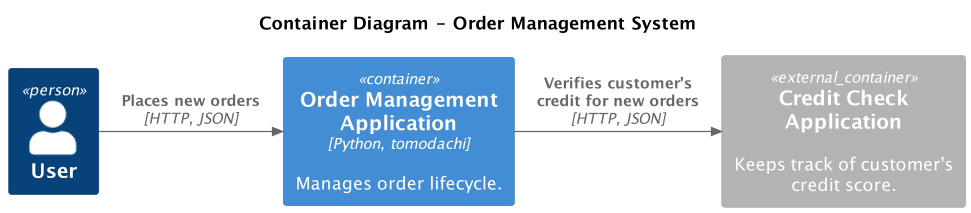

# Testing Applications with Collaborator Services

In the previous section, we explored [testing applications that depend on backing services](./testing-app-with-backing-services.md) like databases or cloud providers.
This section focuses on another type of external dependency - collaborator services.

A collaborator service is another application or a third-party service that our application depends on.
They might be developed in-house or be off-the-shelf software.
Collaborator services provide a valuable behavior and expose it through an API such as REST, GraphQL, gRPC, asynchronous messaging, etc.
For example, when building a financial system, we might use an external application to obtain currency conversion rates or process credit card payments.

In automated testing, it's often not feasible to use the real versions of external applications -
they might be slow, expensive, flaky, unreliable, and they might not have a dedicated test environment.
If the external application's source code or executable is available, we might launch it in a local testing environment.
However, the external app most probably depends on other applications and backing services.
Therefore, to test a single application in isolation, we'll end up running a large and complicated environment of many different applications -
this is the problem that Testcontainers help avoid.

## Mocking Collaborator Services

During testing as part of the development workflow, we don't want to depend on real versions of external applications
because our test environment's complexity will grow, the tests might become flaky, and we won't have any control over the test environment.
For example, suppose we want to test that a financial system converts a transaction's currency.
The real currency exchange rates change daily, so our financial system's test results will fail every time the new conversion rates are published.
To avoid this problem, we must be able to control all variables in the test environment.

One solution we'll explore is mocking an external application by creating a fake version of its API that returns predefined data.
This way, we'll simulate requests and responses from the external app and be able to test our application in isolation.
To mock external APIs, we can use mocking servers: [WireMock](https://wiremock.org/), [MockServer](https://www.mock-server.com/),
[VCR.py](https://vcrpy.readthedocs.io/en/latest/), [mountebank](https://www.mbtest.org/), and many more.

## Example: Mocking Customer Credit Check Application

Let's create an example order management application.
A customer's credit must be verified during a new order creation process.
If the customer has good credit, new order creation is allowed. If the credit check fails,
the customer can't create new orders until the credit is improved, e.g., by paying all invoices for previous orders.
Since credit verification is a complex process, the order management application doesn't implement it;
instead, it uses an external app - the customer credit check service.

<figure markdown>
  
</figure>

We'll use the [WireMock](https://wiremock.org/) HTTP mock server to mock the credit check service's `POST /check-credit` API.
WireMock is an open-source tool for API mock testing. It can help you to create stable test and development environments,
isolate yourself from flaky third parties, and simulate APIs that don't exist yet.
Tomodachi Testcontainer provides a [WireMockContainer][tomodachi_testcontainers.WireMockContainer]
and [wiremock_container][tomodachi_testcontainers.pytest.wiremock_container] fixture.
Used together with [Python WireMock SDK](https://github.com/wiremock/python-wiremock), creating API mocks is easy.

!!! warning

    Since mocks are configured manually, they might not accurately reflect the behavior of a real system.
    An application tested only with mocks might not work the same in a production environment.
    Depending on your use case, consider [verifying your test doubles](https://pythonspeed.com/articles/verified-fakes/)
    against a real system in a separate test suite or adding [contract tests](https://martinfowler.com/bliki/ContractTest.html).
    Check out [Pact](https://pact.io/) - a tool for contract testing.

### Creating the order management application

The example application has a single endpoint `POST /order` that expects two `string` values in the request body: `customer_id` and `product`.
On successful order creation, the `Order` object is returned in a response.
If the credit check fails, the following errors are returned: `CREDIT_CHECK_FAILED` or `CREDIT_CHECK_UNAVAILABLE`.

```py title="src/app.py" hl_lines="13-16"
--8<-- "docs_src/getting_started/orders/app.py"
```

The new order creation service creates a new `Order` object and calls customer credit verification.
The order is not stored in a database to keep the example simple.

```py title="src/services.py" hl_lines="13"
--8<-- "docs_src/getting_started/orders/services.py"
```

The `Order` is a simple `dataclass` object.

```py title="src/domain.py"
--8<-- "docs_src/getting_started/orders/domain.py"
```

The `verify_customer_credit` function calls the external credit check service via HTTP.
The URL of the service is configured with the `CREDIT_CHECK_SERVICE_URL` environment variable.
It will help us change the service URL in a test environment.
If the response status code is something other than `2xx`, the `CreditCheckUnavailableError` is raised.
If the credit verification status is not `CREDIT_CHECK_PASSED`, the `CustomerCreditCheckFailedError` is raised.

```py title="src/credit_check.py" hl_lines="16-19 32"
--8<-- "docs_src/getting_started/orders/credit_check.py"
```

### Configuring Testcontainers

To start the `WireMockContainer`, we'll use the `wiremock_container` fixture.
The credit check service's URL is configured with the `CREDIT_CHECK_SERVICE_URL` environment variable -
it's set to WireMock's URL, so requests for verifying the customer credit will be sent to
the WireMock instance running locally in a Docker container.

```py title="tests/conftest.py" hl_lines="13 20"
--8<-- "docs_src/getting_started/orders/conftest.py"
```

### Writing end-to-end tests

In the first test, we'll test a successful order creation when the customer's credit check passes.
Before testing the order management application, we need to configure the `POST /check-check` API in WireMock.
To easily configure WireMock, we'll use Python WireMock SDK.
Install it from extras with `pip install tomodachi-testcontainers[wiremock]` or `pip install wiremock`.
The `wiremock_container` fixture automatically configures the SDK to communicate with the WireMock server if the [WireMock extra is installed](../installation.md).

The mock setup code configures WireMock to return JSON body `{"status": "CREDIT_CHECK_PASSED"}` when it receives
a `POST` request to the endpoint `/credit-check`, and the request body is `{"customer_id": "123456"}`.
After sending the `POST /order` request to the order service, we receive a successful response indicating that the order has been created.
The order services successfully called WireMock, which returned the fake credit check service's response!

```py title="tests/test_app.py" hl_lines="11 16 21"
--8<--
docs_src/getting_started/orders/test_app001.py:test_order_created_when_credit_check_passed
--8<--
```

Let's test what happens when a customer's credit check verification fails.
We configure the WireMock to respond with JSON body `{"status": "CREDIT_CHECK_FAILED"}`.
After calling the order management service, we receive the expected `HTTP 400` and `{"error": "CREDIT_CHECK_FAILED"}`.

```py title="tests/test_app.py" hl_lines="11 21-22"
--8<--
docs_src/getting_started/orders/test_app001.py:test_order_not_created_when_credit_check_failed
--8<--
```

The last example tests the scenario when the credit verification service responds with an Internal Server Error.
This error scenario is very hard to simulate when testing with a real version of the external application.
Using mocks, you control the environment and all its variables.
In this test, the WireMock is configured to return `HTTP 500` with the `Internal Server Error` response;
the order management service returns `HTTP 503` and `{"error": "CREDIT_CHECK_UNAVAILABLE"}`.

```py title="tests/test_app.py" hl_lines="6-7 17-18"
--8<--
docs_src/getting_started/orders/test_app001.py:test_order_not_created_when_credit_check_service_unavailable
--8<--
```

### Extracting mock setup functions

Setting up the mocks requires lengthy boilerplate code, even for these simple test examples.
In the real world, the API mock setup will be tens of code lines configuring nested request/response data structures.
It's a good idea to extract mock setup code to separate functions and modules.

```py title="tests/credit_check_mocks.py"
--8<-- "docs_src/getting_started/orders/credit_check_mocks.py"
```

Now, the tests are shorter and better express their intent.

```py title="tests/test_app.py" hl_lines="6"
--8<-- "docs_src/getting_started/orders/test_app002.py"
```

## Summary

TODO

## Resources

- <https://pythonspeed.com/articles/verified-fakes/>
- <https://martinfowler.com/bliki/ContractTest.html>
- <https://pact.io/>
- <https://wiremock.org/>
- <https://www.mock-server.com/>
- <https://vcrpy.readthedocs.io/en/latest/>
- <https://www.mbtest.org/>
