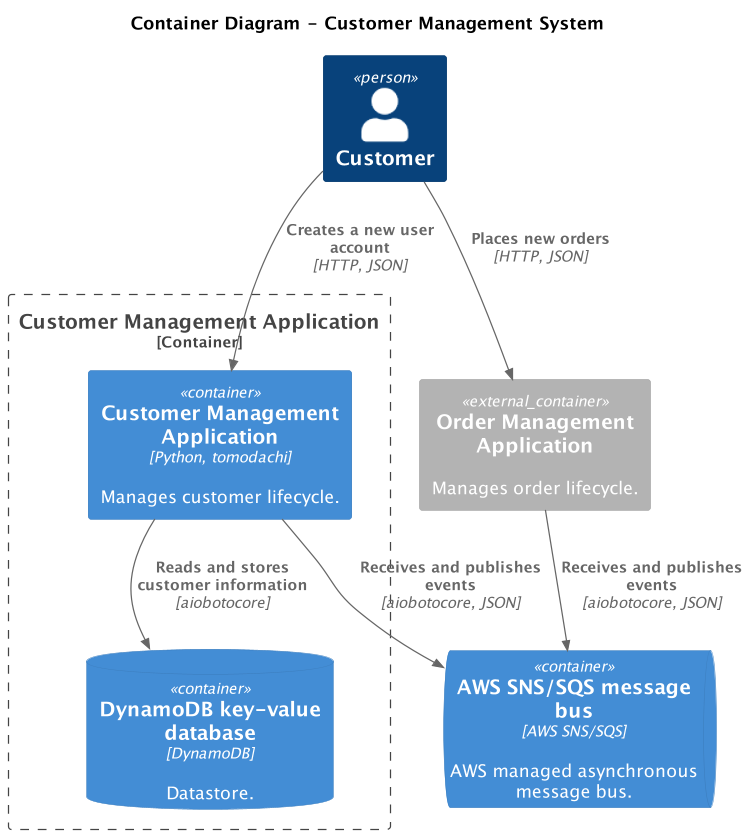

# Testing Asynchronous Systems

In the [previous section](./testing-app-with-collaborator-services.md), we tested an application that directly depends on another application's HTTP API;
we mocked its public API with an HTTP mock server.
This section will explore another scenario - testing an application that depends on other services through asynchronous message bus.

## Example: Event-Driven Customer Management Application

Let's test an example Customer Management Application.
A user can create a new account in the Customer application and place new orders in the Order application.
The Customer and Order apps communicate through an asynchronous message bus, in this example, [AWS SNS/SQS](https://aws.amazon.com/sns/).
When the customer creates a new account, the Customer app publishes a `CustomerCreated` event to the message bus.
When the customer creates a new order, the Order app publishes an `OrderCreated` event to the message bus.
The Customer application listens for `OrderCreated` events and saves a list of orders that belong to the customer.

!!! success "The apps communicate indirectly through the message bus"

    A message bus is a decoupling point. The Customer and Order apps communicate indirectly through the message bus.
    To test the Customer app in isolation, we don't need to run a real or mocked version of the Order app -
    We only need to publish the Order app's events to the message bus to simulate interactions with the Customer app.

<figure markdown>
  
</figure>

### Creating the customer management application

Let's first create the example Customer application.

!!! note

    Since this example involves setting up many dependencies like AWS DynamoDB and AWS SNS/SQS,
    the setup code is omitted for brevity.
    [Find the complete example's code in GitHub](https://github.com/filipsnastins/tomodachi-testcontainers/tree/main/docs_src/getting_started/customers).

The app has three endpoints:

- HTTP `POST /customer` - for new customer creation, publishes `CustomerCreatedEvent` to AWS SNS.
- HTTP `GET /customer/<id>` - for querying existing customers.
- AWS SQS consumer listening for `OrderCreatedEvents` - saves the received Order identifier on an existing customer's object.

```py title="src/app.py" hl_lines="4 22 29-31"
class Service(tomodachi.Service):
    ...

--8<--
docs_src/getting_started/customers/app.py:endpoints
--8<--
```

### Configuring Testcontainers

The Testcontainer's configuration in this example is involved because we must configure two infrastructure dependencies - AWS DynamoDB and AWS SNS/SQS.

- The fixture `_create_topics_and_queues` creates necessary [pub/sub](https://en.wikipedia.org/wiki/Publish%E2%80%93subscribe_pattern) topics and queues
  for the Customer and Order app to communicate through the AWS SNS/SQS message bus.

- The fixture `_purge_queues_on_teardown` deletes all messages from the queues after every test to ensure test isolation - that messages
  don't leak between tests.

- The `tomodachi_container` fixture uses `LocalStackContainer` to emulate AWS DynamoDB and AWS SNS/SQS - in the same way as in the
  [Testing Applications with Backing Services](./testing-app-with-backing-services.md) guide.
  The `TomodachiContainer` is configured with the LocalStack container's environment variables.
  The `_create_topics_and_queues` fixture is used in the `tomodachi_container` fixture to ensure that topics and queues
  are created before the Customer application starts.

```py title="tests/conftest.py" hl_lines="13 18-19 28-29"
--8<-- "docs_src/getting_started/customers/conftest.py"
```

### Testing for published messages

Let's test the first scenario - a customer creates a new account by calling the `POST /customer` endpoint,
and a new `CustomerCreatedEvent` is published to notify surrounding systems that a new customer has registered.

First, the test calls the `POST /customer` endpoint and creates a new customer. To test that the `CustomerCreatedEvent` has been published,
the test attempts to retrieve a message from the `customer--created`
queue using the [`SNSSQSTestClient`][tomodachi_testcontainers.clients.SNSSQSTestClient] provided by Tomodachi Testcontainers
for easier testing of AWS SNS/SQS pub/sub with the [Tomodachi framework](https://github.com/kalaspuff/tomodachi).
The `SNSSQSTestClient` is accessed with the [`localstack_snssqs_tc`][tomodachi_testcontainers.pytest.localstack_snssqs_tc] fixture.

!!! danger

    This test has a problem - since the message bus is asynchronous, it's not guaranteed that the `CustomerCreatedEvent` will be immediately
    visible to consumers. It takes some time from the moment the message is published until it's visible to consumers.
    Therefore, this test is flaky - no messages might be visible yet, so the test can randomly fail.

```py title="tests/test_app.py" hl_lines="12 15 21"
--8<-- "docs_src/getting_started/customers/test_app001.py"
```

To fix the test, we need to wait until the message becomes visible.
The easiest solution is to sleep for a fixed time between the customer creation and the attempt to receive the message.

!!! danger

    This approach works; however, tests will become slow on a larger scale due to unnecessary waiting.
    For example, in a test suite of 60 test cases, there'll be an additional 60 seconds of waiting.

```py title="tests/test_app.py" hl_lines="22"
--8<-- "docs_src/getting_started/customers/test_app002.py"
```

### Using Asynchronous Probing for testing asynchronous systems

Using asynchronous probing (sampling) is better than sleeping for a fixed time.
The idea of asynchronous probing is continuously testing for a condition in short time intervals.

Tomodachi Testcontainers provides a [`probe_until`][tomodachi_testcontainers.pytest.async_probes.probe_until] function for asynchronous probing.
The `probe_until` receives _a probe function_. The probe is continuously invoked in `probe_interval` (defaults to `0.1 second`) until it finishes without exceptions.
When the `stop_after` timeout is reached (defaults to `3.0` seconds), the probing is stopped, and the last probe's exception is raised.

In our test, we define the probe function - `_customer_created_event_emitted`. The probe reads messages from the SQS queue
and expects to find one message. If no messages are returned, the probe will fail with `ValueError` and will be retried in `probe_interval`.
When the probe receives one message from the SQS queue, it's returned from the probe to the main test body.

!!! note

    A probe must contain an assertion, e.g., a check that exactly one message is received from the queue.
    In this example, the assertion is the list unpacking operation `[event] = localstack_snssqs_tc.receive(...)`.
    It could also be `events = localstack_snssqs_tc.receive(...); assert len(events) == 1`.

```py title="tests/test_app.py" hl_lines="6 20-22 24"
--8<-- "docs_src/getting_started/customers/test_app003.py"
```

!!! success "Asynchronous probing reduces wait time"

    The benefit of asynchronous probing is minimal wait time - as soon as the message is received, the test stops waiting.
    This way, we ensure fast test runtime.

    The [`probe_until`][tomodachi_testcontainers.pytest.async_probes.probe_until] is inspired by
    [Awaitility](https://github.com/awaitility/awaitility) and [busypie](https://github.com/rockem/busypie) -
    read more about testing asynchronous systems in their documentation.

### Probing for no visible effect

Sometimes, we'd like to test that a system doesn't publish a specific message.
For example, let's test that a message consumer implements the [idempotent consumer pattern](https://microservices.io/patterns/communication-style/idempotent-consumer.html) -
it performs an operation only once and discards duplicate messages.

There are several ways to test this:

- Publish two duplicate messages and probe that exactly one outcome message has been published.
- Publish a single message and assert that an outcome message has been published. Then, publish the duplicate
  message and [`probe_during_interval`][tomodachi_testcontainers.pytest.async_probes.probe_during_interval]
  that the outcome message is not published for, e.g., `3` seconds.

The downside of the second approach is that it introduces extra wait time for the tests; however, sometimes, it's a helpful technique.

### Testing asynchronous message consumers

Let's test that our Customer app consumes `OrderCreatedEvents` and associates new orders with existing customers.

- In the `arrange` step, we create a new customer.

- Then, in the `act` step, we publish two SNS messages to the `order--created` topic with predefined order identifiers.

- In the `assert` step, we probe the `GET /customer/<id>` API until two messages are consumed - the two orders are associated with the customer.

Since the message consumer (Customer app) is asynchronous, it takes time for messages to be picked up and processed.
Therefore, using asynchronous probing, we continuously check the system's state until all published messages are consumed.

```py title="tests/test_app.py" hl_lines="21-22 29 37-38 42"
--8<-- "docs_src/getting_started/customers/test_app004.py"
```

### Testing error-handling with dead-letter queues

When a consumer cannot process a message, it's a good practice to move it to a
[dead-letter queue (DLQ)](https://docs.aws.amazon.com/AWSSimpleQueueService/latest/SQSDeveloperGuide/sqs-dead-letter-queues.html)
for further troubleshooting.
Otherwise, a faulty message can be lost or retried forever.

The `handle_order_created` message consumer is configured to move faulty messages to the `customer--order-created--dlq` DLQ.
In Tomodachi framework, it's necessary to raise the `AWSSNSSQSInternalServiceError` to retry a message; otherwise, it's deleted from a queue.

In AWS SQS, the [`visibility_timeout`](https://docs.aws.amazon.com/AWSSimpleQueueService/latest/SQSDeveloperGuide/sqs-visibility-timeout.html)
specifies when a consumed message becomes visible again to other consumers.
By default, it's `30 seconds`, so our test would have to wait `30 seconds` to receive a message from the DLQ - it's too long for a single test.
To speed up the test, in the autotest environment, we set the environment variable `AWS_SQS_VISIBILITY_TIMEOUT` to something smaller, e.g., `3 seconds`,
and decrease number of retries to `1` with the `AWS_SQS_MAX_RECEIVE_COUNT` environment variable.
The setting should be no less than the default `30 seconds` in a production environment.

```py title="src/app.py" hl_lines="7-8 10 16-17"
class Service(tomodachi.Service):
    ...

--8<--
docs_src/getting_started/customers/app.py:handle_order_created
--8<--
```

Let's test that the `OrderCreatedEvent` message is moved to the DLQ if the given `customer_id` is not found in the customer's database.
Due to message retries and `visibility_timeout`, we set the async probe's `stop_after` value to a higher value, e.g., `10 seconds`.

```py title="tests/test_app.py" hl_lines="25-27 29-30"
--8<-- "docs_src/getting_started/customers/test_app005.py"
```

### Other application tests

For completeness, let's add the customer application's HTTP endpoint tests.

```py title="tests/test_app.py"
--8<-- "docs_src/getting_started/customers/test_app006.py"
```

## Summary

TODO

## References

- <https://aws.amazon.com/sns/>
- <https://en.wikipedia.org/wiki/Publish-subscribe_pattern>
- <http://www.awaitility.org/>
- <https://github.com/rockem/busypie>
- <https://github.com/kalaspuff/tomodachi>
- <https://docs.aws.amazon.com/AWSSimpleQueueService/latest/SQSDeveloperGuide/sqs-dead-letter-queues.html>
- <https://docs.aws.amazon.com/AWSSimpleQueueService/latest/SQSDeveloperGuide/sqs-visibility-timeout.html>
