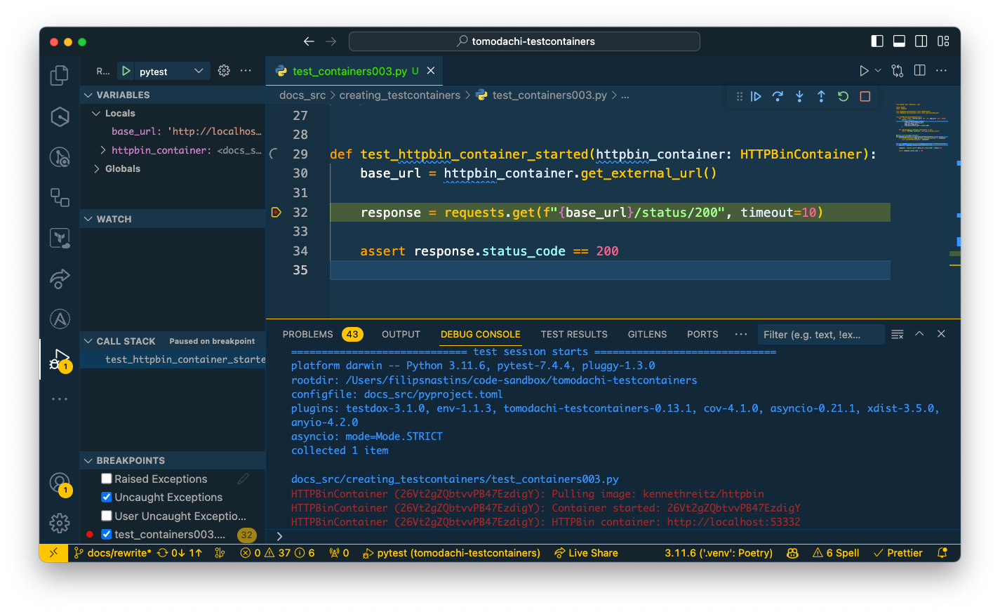
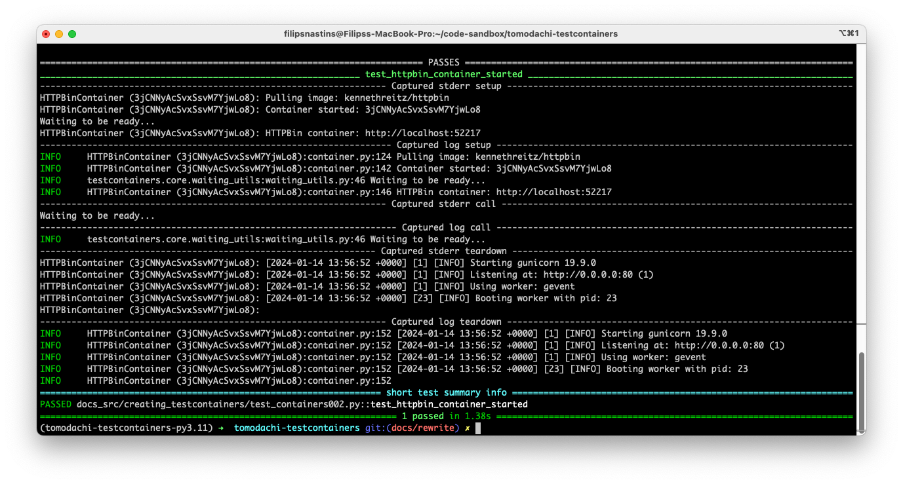

# Creating new Testcontainers

When you need to create a new Testcontainer when a ready made version is unavailable,
it's not harder than writing a `docker run` command.
Testcontainers library API minimizes the amount of boilerplate code needed to be written.

This guide will use the [`HTTPBin`](https://httpbin.org/) application as an example for creating new Testcontainers.
`HTTPBin` is a simple HTTP Request & Response Service;
its Docker image tag at DockerHub is [`kennethreitz/httpbin`](https://hub.docker.com/r/kennethreitz/httpbin).

## Creating new Testcontainers with `testcontainers-python` library

You don't need to use Tomodachi Testcontainers if you don't want to.
It's built on top of the Python library [testcontainers-python](https://github.com/testcontainers/testcontainers-python),
so that's all you need to start using Testcontainers.

The `testcontainers-python` provides a base class for defining Docker Containers - `testcontainers.core.container.DockerContainer`.
New containers are created by defining a new class and inheriting from the `DockerContainer` base class.

!!! note

    The [testcontainers-python](https://github.com/testcontainers/testcontainers-python) library
    has a lot of Testcontainer examples. To learn more about creating and configuring Testcontainers
    in Python, take a look at the library's source code.

```py hl_lines="5-6 11 18"
--8<-- "docs_src/creating_testcontainers/test_containers001.py"
```

It's necessary to override the `start` method and include a waiter function that checks that the container has started.
The `testcontainers-python` provides a `wait_for_logs` utility for searching container log patterns with regular expressions.
To ensure that the `HTTPBin` container has started, we're waiting until the container emits the `Listening` at log.
Container creation is an asynchronous process - it takes time for the application inside the container to start,
so if we're not waiting until the app is ready and try to access it immediately, the tests will fail.

## Creating new Testcontainers with `tomodachi-testcontainers` library

Tomodachi Testcontainers have a couple of base classes for defining new Testcontainers:

- [`tomodachi_testcontainers.DockerContainer`][tomodachi_testcontainers.DockerContainer] - generic base class for all types of containers.
- [`tomodachi_testcontainers.WebContainer`][tomodachi_testcontainers.WebContainer] - base class for web application containers.
- [`tomodachi_testcontainers.DatabaseContainer`][tomodachi_testcontainers.DatabaseContainer] - base class for relational database containers.

### Using `DockerContainer` for generic containers

The [`tomodachi_testcontainers.DockerContainer`][tomodachi_testcontainers.DockerContainer] base class inherits from
`testcontainers.core.container.DockerContainer`.
It adds some [extra features](../features.md) - runs Testcontainers in a separate Docker network,
forwards container logs to Python's standard logger, etc.

It's used the same as `testcontainers.core.container.DockerContainer`,
except it requires the definition of a method `log_message_on_container_start`;
it logs a custom message when a container starts. It helps to access a Testcontainer while debugging.
Since the container's port is selected randomly for every test run, it's helpful to output an HTTP URL
to be able to open an app running in the container and interact with it.

```py hl_lines="7-8 16-17"
--8<-- "docs_src/creating_testcontainers/test_containers002.py"
```

In the image below, the `log_message_on_container_start` outputs an HTTP URL to the debug console
for accessing the container's app.

<figure markdown>
  
  <figcaption>HTTPBin container URL is printed in the VSCode debug console (last row).</figcaption>
</figure>

The [`tomodachi_testcontainers.DockerContainer`][tomodachi_testcontainers.DockerContainer]
forwards the container's logs to the pytest test output, which is useful
for debugging what happened inside the container.

<figure markdown>
  
  <figcaption>HTTPBin container logs are forwarded to pytest test output.</figcaption>
</figure>

### Using `WebContainer` for web application containers

Running web applications in Docker containers is common, so
[`tomodachi_testcontainers.WebContainer`][tomodachi_testcontainers.WebContainer]
base class provides a convenient way to run web app containers.

It works out of the box for web apps that run on a single port.
Simply provide the `internal_port` and `edge_port`, and `WebContainer` will bind them.
If you need to bind more ports, bind each port separately with the `self.with_bind_ports()` method.

The `WebContainer` also provides an optional `http_healthcheck_path` param
similar to the [Docker Healthcheck](https://docs.docker.com/engine/reference/builder/#healthcheck).
To wait until a web app inside the container has started, the `WebContainer`
will continuously request the application's `http_healthcheck_path` endpoint until it returns
the `HTTP 200` status code. This waiting strategy is more efficient and generic
than waiting for the container's logs.

Lastly, the `WebContainer` provides helper methods, e.g.,
`get_internal_url` and `get_external_url`, for fetching the container's HTTP endpoints.
See all methods in the [code reference][tomodachi_testcontainers.WebContainer].

```py hl_lines="6 14-16 30"
--8<-- "docs_src/creating_testcontainers/test_containers003.py"
```
