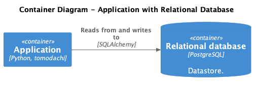
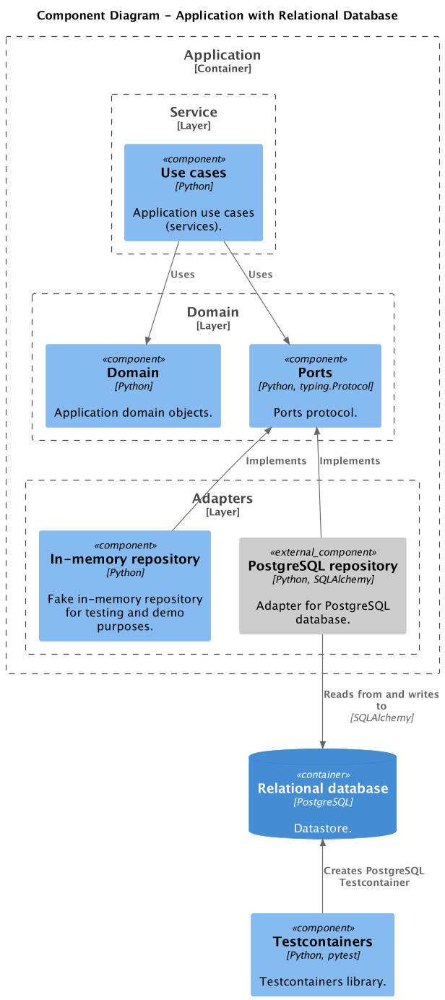

# Testing Repositories

- [ ] Test Repository in isolation with a real database.
- [ ] Use fakes/mocks in other unit tests where database access is not required.
- [ ] Test your fake Repository with the same suite of tests as the real Repository.
- [ ] Where it makes sense to use Repository pattern, and where is it an overkill?
- [ ] Round-trip testing to not expose Repository implementation details.

## Using database mocks/fakes in unit tests

Move this section to `testing-databases` and add a link to this page as a next step.

- [ ] When we want unit tests to run without a real database
- [ ] Link to "Testing Repositories"

## References

- <https://martinfowler.com/eaaCatalog/repository.html>
- <https://www.cosmicpython.com/book/chapter_02_repository.html>
